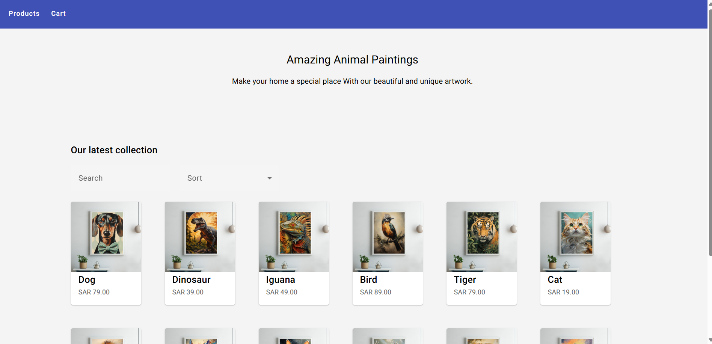
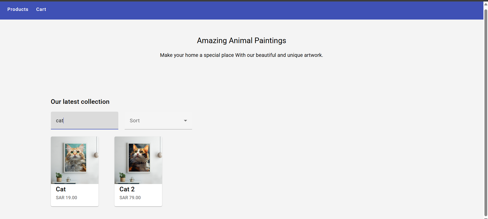
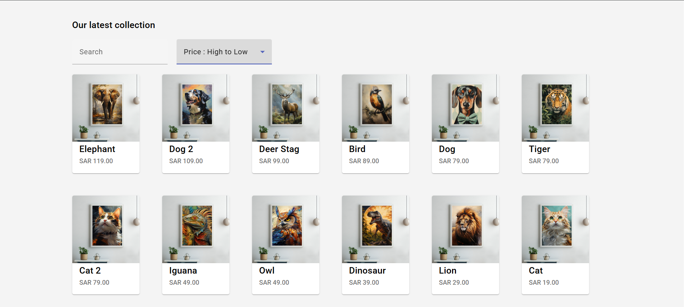

# 🖼 Animal Paintings

## Description
This project is an Animal Paintings Gallery built using Angular.
It demonstrates Routing, Services, HttpClient, and dynamic features like searching and sorting data.

## Features
- Display all paintings dynamically

- Search paintings by name

- Sort paintings by price

## Technologies Used
- Angular 16

- TypeScript

- RxJS

- HttpClient

- HTML / CSS
